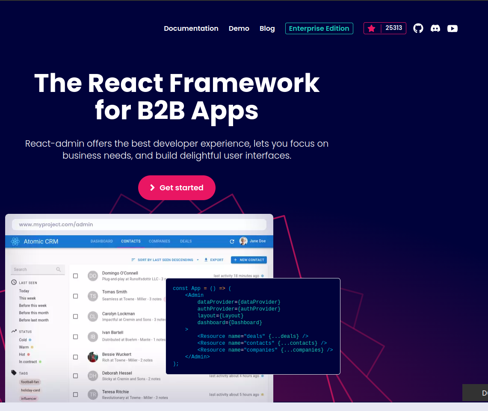
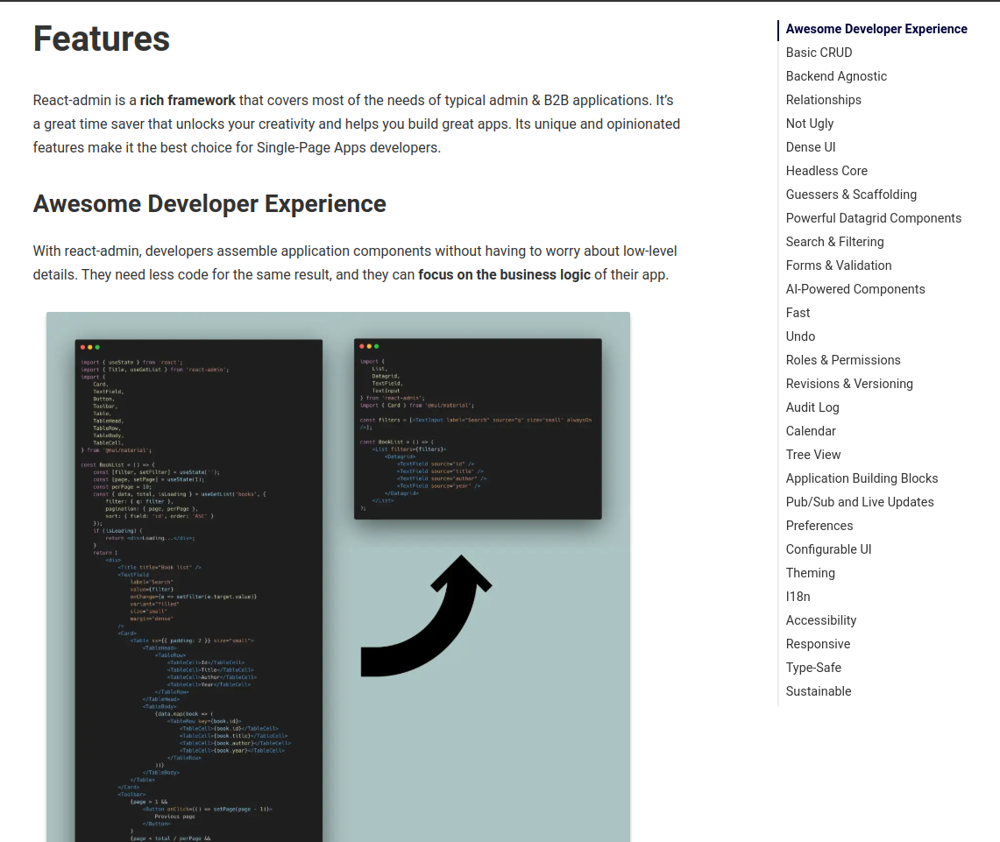
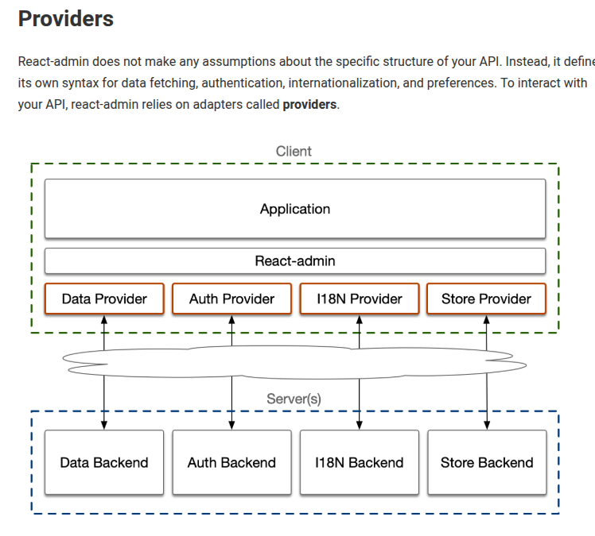

# Roadmap react admin

#### Clone & Run the project

Clone the project

```bashNouvelle page d'accueil.
    git clone https://github.com/AmourRamanantsiresy/web3-admin.git
```

Open the project folder

```bash
    cd web3-admin
```

Install dependencies using peer deps

```bash
    npm install --legacy-peer-deps
```

#### Getting started

1. Javascript utilities

   - Function as return value
   - Destructuration

2. Typescript

   - Simple typing to avoid any

3. React utilities

   - State
   - Routing
   - Hooks
   - Context

4. React admin theory

   - What is it ?
     
   - Why should we use it ?
     
   - What technologies it use ?
     - React
     - Material UI
     - React Router Dom
     - React Query
     - I18N

5. React admin notion (How it works ?)
   

   - Admin
   - Ressource
   - Providers
   - Pages

6. React admin practice
   - Initialize react admin
   - Create first route
   - Create data provider
   - Create
